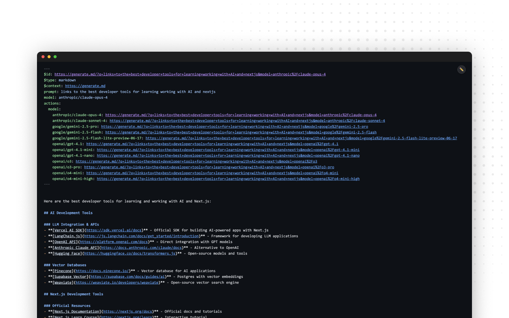

# @mdxui/chrome - MDX File Viewer

A Chrome extension that transforms how you view Markdown, MDX, and text files by providing rich syntax highlighting and an interactive code editor. Features dual rendering modes: beautiful syntax highlighting for browsing and a full-featured editor for viewing and experimenting with code.



## 🌟 Features

### Dual Rendering Modes

- **Browse Mode**: Beautiful syntax-highlighted rendering with real-time code block processing.
- **Edit Mode**: Full-featured code editor with IntelliSense for viewing and experimenting with code.
- **Seamless Mode Switching**: Toggle between modes with `Cmd/Ctrl + Shift + L` or the floating toggle button.

### Advanced Rendering

- **Streaming Code Blocks**: Real-time syntax highlighting as content loads via Shiki.
- **HTML Block Processing**: Special handling for `<usage>`, `<Note>`, and other custom HTML blocks.
- **Frontmatter Support**: YAML frontmatter is automatically parsed and highlighted.
- **Incomplete Block Handling**: Graceful rendering of streaming/incomplete content.

### Rich UI & UX

- **GitHub Dark Theme**: Instant-loading dark theme for optimal readability, now with subtle shadows on code blocks.
- **Responsive & Fast**: Feels fast and responsive with optimized render and scroll settings.
- **Auto-scroll**: Intelligently follows streaming content with a user-friendly scroll threshold.
- **Smart Content Detection**: Handles `text/plain` markdown files correctly.

## 📁 Project Structure

```
src/
├── background.ts           # Service worker - extension management
├── content-unified.ts      # Main content script - unified dual mode rendering
├── constants/
│   └── index.ts           # Configuration constants
├── types/
│   └── index.ts           # TypeScript type definitions
└── utils/
    ├── chrome-utils.ts    # Chrome extension utilities
    ├── dom-utils.ts       # DOM manipulation helpers
    ├── file-detection.ts  # File type detection logic
    └── monaco-renderer.ts # Monaco editor integration
```

## 🏗️ Architecture

The extension uses **Shiki** for syntax highlighting and **Monaco Editor** for code viewing and experimentation, providing industry-standard rendering and editor capabilities.

### Unified Content Script

The extension uses a single, comprehensive content script (`content-unified.ts`) that handles:

- Dual mode rendering (Browse/Edit)
- Streaming content processing
- Monaco editor integration
- Auto-scroll functionality
- Mode switching and UI management
- File detection and content extraction

This unified approach provides:

- **Simpler deployment** - Single content script file
- **Better performance** - No module loading overhead
- **Easier debugging** - All logic in one place
- **Reduced complexity** - Fewer inter-module dependencies

### Mode Architecture

The extension operates in two distinct modes:

1. **Browse Mode (Shiki)**

   - Uses Shiki for offline syntax highlighting
   - Streams content processing for real-time updates
   - Handles incomplete/streaming markdown gracefully
   - Optimized for reading and browsing

2. **Edit Mode (Monaco)**
   - Uses Monaco Editor for code viewing and experimentation
   - Full IntelliSense and syntax highlighting capabilities
   - Workers disabled for Chrome extension compatibility
   - Note: File saving functionality coming soon

### Content Script Integration

- **Extension Context**: Shiki bundled for syntax highlighting
- **Page Context**: Monaco editor bundled for code viewing
- **Direct Integration**: Monaco editor runs in main thread without workers
- **Background Script**: Handles extension state and tab management

### File Detection Strategy

- **URL-based**: Detects file extensions and patterns
- **MIME-type**: Validates content types for accuracy
- **Smart Detection**: Treats `text/plain` files with markdown extensions as markdown
- **Special Cases**: Handles `llms.txt` and direct file access
- **Website Protection**: Only activates on actual files, not regular websites

## 🚀 Usage

### Developer Installation (Step-by-Step)

#### Prerequisites

- **Node.js** (v18 or later)
- **pnpm** package manager
- **Google Chrome** browser
- **Git** (to clone the repository)

#### Step 1: Clone and Setup

```bash
# Clone the repository
git clone <repository-url>
cd mdx

# Install dependencies and build
cd packages/mdxui/chrome
pnpm install
pnpm build
```

#### Step 2: Load Extension in Chrome

1. **Open Chrome Extensions Page**

   - Type `chrome://extensions/` in your address bar and press Enter
   - Or go to Chrome menu → More Tools → Extensions

2. **Enable Developer Mode**

   - Look for "Developer mode" toggle in the top-right corner
   - Click to enable it (you'll see additional buttons appear)

3. **Load the Extension**

   - Click the **"Load unpacked"** button
   - Navigate to your project folder: `mdx/packages/mdxui/chrome/dist`
   - Click **"Select Folder"** (or **"Open"** on Mac)

4. **Verify Installation**
   - You should see "@mdxui/chrome - MDX File Viewer" in your extensions list
   - The extension should show as "Enabled"

#### Step 3: Enable File Access (Required for Local Files)

1. **Find Your Extension**

   - Stay on `chrome://extensions/`
   - Locate "@mdxui/chrome - MDX File Viewer"

2. **Enable File URLs**
   - Click **"Details"** on the extension card
   - Scroll down to find **"Allow access to file URLs"**
   - Toggle this setting **ON**

#### Step 4: Test the Extension

1. **Open a Markdown File**

   - Create a test file: `test.md`
   - Add some content with code blocks:

     ````markdown
     # Test File

     ```javascript
     console.log('Hello World!')
     ```
     ````

     ```

     ```

2. **View in Chrome**

   - Drag the `test.md` file into Chrome, or
   - Use `Ctrl+O` (or `Cmd+O` on Mac) to open the file
   - You should see syntax-highlighted content

3. **Test Mode Switching**
   - Look for the floating toggle button in the top-right corner
   - **In Browse mode**: You'll see a pencil icon (✏️) - click to switch to Edit mode
   - **In Edit mode**: You'll see an eye icon (👀) - click to switch to Browse mode
   - Or use keyboard shortcut: `Ctrl+Shift+L` (or `Cmd+Shift+L` on Mac)

### Troubleshooting

- **Extension not loading?** Check the Console tab in `chrome://extensions/` for errors
- **Files not rendering?** Ensure "Allow access to file URLs" is enabled
- **Build errors?** Make sure you're using Node.js v18+ and pnpm
- **Mode toggle not working?** Check that the file is a supported type (.md, .mdx, .txt, etc.)

### File Access

3. Click "Details"
4. Enable "Allow access to file URLs"

### Keyboard Shortcuts

- **`Cmd/Ctrl + Shift + L`**: Toggle between Browse and Edit modes
- **Auto-scroll**: Automatically follows streaming content (can be disabled by scrolling manually)

### Mode Switching

- **Toggle Button**: Floating button in top-right corner
- **Visual Indicators**:
  - ✏️ Browse mode (syntax highlighting) - shows pencil icon
  - 👀 Edit mode (code editor - view/experiment) - shows eye icon

## 🔧 Configuration

### Build Configurations

#### Standard Build (`pnpm build`)

- **Target**: `chrome91`
- **Output**: `dist/`
- **Bundle Size**: ~8.9MB (includes Shiki)
- **Minification**: Enabled
- **Tree-shaking**: Enabled

### Environment Variables

```typescript
// Rendering Settings
RENDER_DEBOUNCE_MS = 10 // Streaming render delay for a more responsive feel
SCROLL_THRESHOLD_PX = 200 // Larger auto-scroll sensitivity zone for better UX
MONACO_INIT_TIMEOUT_MS = 10000 // Monaco load timeout
```

## 🎨 Themes and Styling

### Shiki Theme

- **Default**: `github-dark`
- **Fallback**: Text rendering with monospace font
- **Custom CSS**: Responsive typography and spacing

### Monaco Theme

- **Base**: `vs-dark`
- **Custom**: GitHub Dark color scheme
- **Features**: Line highlighting, selection, cursor styling

## 🔍 Bundle Analysis

Use the included analyzer to understand bundle composition:

```bash
pnpm analyze
```

This generates:

- **Metafile**: Detailed dependency analysis
- **Size Report**: Per-file size breakdown
- **Largest Dependencies**: Top contributors to bundle size

## 📊 Performance Metrics

### Current Bundle Sizes

- **Background Script**: 1.3 KB
- **Content Script**: 8.6 MB (includes optimized Shiki + Monaco)
- **Content CSS**: 130 KB (Monaco editor styles)
- **Codicon Font**: 78 KB (Monaco icons)
- **Extension Icon**: 2.1 KB (128x128px PNG)
- **Manifest**: 593 bytes
- **Total Extension**: ~8.81 MB

### Architecture Benefits

- **Single File Approach**: Unified content script eliminates module coordination complexity
- **Direct Dependencies**: All functionality directly accessible without import overhead
- **Optimized Bundling**: tsup efficiently bundles the unified script

### Current Optimizations

#### 1. **Shiki Web Bundle**

```typescript
// Using optimized web bundle instead of full Shiki package
import { createHighlighter } from 'shiki/bundle/web'
```

#### 2. **Language Subsetting**

```typescript
// Bundle only required languages for smaller size
const highlighter = await createHighlighter({
  themes: ['github-dark'],
  langs: ['yaml', 'javascript', 'typescript', 'markdown', 'html', 'json', 'css'],
})
```

#### 3. **Single Theme Loading**

- Only loads `github-dark` theme instead of multiple themes
- Reduces theme-related bundle overhead

#### 4. **Monaco Worker Suppression**

- Disabled Monaco workers for Chrome extension compatibility
- Prevents console warnings and worker-related errors
- Uses main thread execution for better extension performance

### Future Optimization Opportunities

#### 1. **Further Language Reduction**

Remove unused languages from the current subset if not needed

#### 2. **Core Shiki Implementation**

```typescript
// More granular control (requires more setup)
import { codeToHtml } from 'shiki/core'
import { createOnigurumaEngine } from 'shiki/engine-oniguruma'
```

**Note**: CDN loading is not viable for Chrome extensions due to Content Security Policy restrictions and offline requirements.

#### 6. **Incremental Loading**

```typescript
// Load languages on-demand
const loadLanguage = async (lang: string) => {
  if (!loadedLanguages.has(lang)) {
    await highlighter.loadLanguage(lang)
    loadedLanguages.add(lang)
  }
}
```

## 🐛 Debugging

### Console Output

The extension provides detailed logging:

- **Initialization**: Setup and file detection
- **Mode Switching**: Transition states and errors
- **Rendering**: Shiki processing and Monaco operations
- **Performance**: Loading timing and render optimization

### Common Issues

1. **Monaco Load Failures**: Check for console errors during Monaco initialization
2. **File Detection**: Ensure file has a supported extension (.md, .mdx, .txt, etc.)
3. **Streaming Issues**: Monitor console for Shiki processing errors
4. **Loading Delays**: Check network conditions and file size for rendering performance
5. **Content Not Rendering**: Ensure file type is supported and extension is enabled

## 🧪 Development

### Local Development

```bash
# Watch mode with auto-rebuild
pnpm dev

# Type checking
pnpm typecheck

# Linting
pnpm lint

# Bundle analysis
pnpm analyze
```

### Testing Strategy

- **Manual Testing**: Load various file types and test mode switching
- **Performance Testing**: Monitor memory usage and render times
- **Cross-Browser**: Test Monaco editor functionality across different Chrome versions

## 📈 Recent Improvements

### v0.2.0 Features

- ✅ **UI Polish**: Added a subtle shadow to code blocks for better depth.
- ✅ **Improved UX**: Tuned debounce and scroll constants for a more responsive, real-time feel.
- ✅ **New Logo**: Added a new rounded icon for the extension.
- ✅ **Optimized Loading**: Improved page initialization and rendering performance.
- ✅ **Smart MIME Detection**: Proper handling of markdown served as `text/plain`.
- ✅ **Build Optimization**: Automated packaging with proper asset management.

## 🔮 Future Enhancements

### Short-term

- **File Saving**: Complete Edit Mode with save-to-file functionality
- **Progressive Language Loading**: Load Shiki languages on-demand
- **Theme Customization**: User-configurable themes
- **Performance Monitoring**: Built-in performance metrics

### Long-term

- **Split Architecture**: Separate Shiki and Monaco into optional features
- **Cloud Highlighting**: Server-side syntax highlighting for ultra-light client
- **AI Integration**: LLM-powered code explanation and documentation
- **Multi-file Support**: Side-by-side file comparison

## 📄 License

MIT - See [LICENSE](../../../LICENSE) for details.

## 🤝 Contributing

1. Fork the repository
2. Create a feature branch
3. Make your changes
4. Run tests and linting
5. Submit a pull request

---

**Bundle Size Note**: The current 8.8MB size is primarily due to Shiki's comprehensive language support. Consider the optimization strategies above for production deployments requiring smaller bundle sizes.
